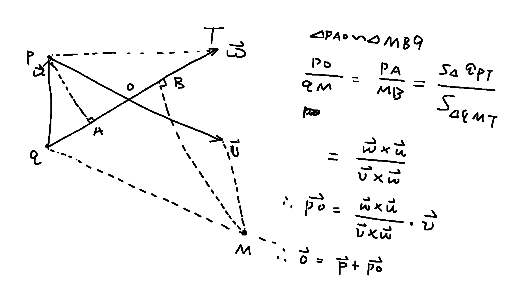
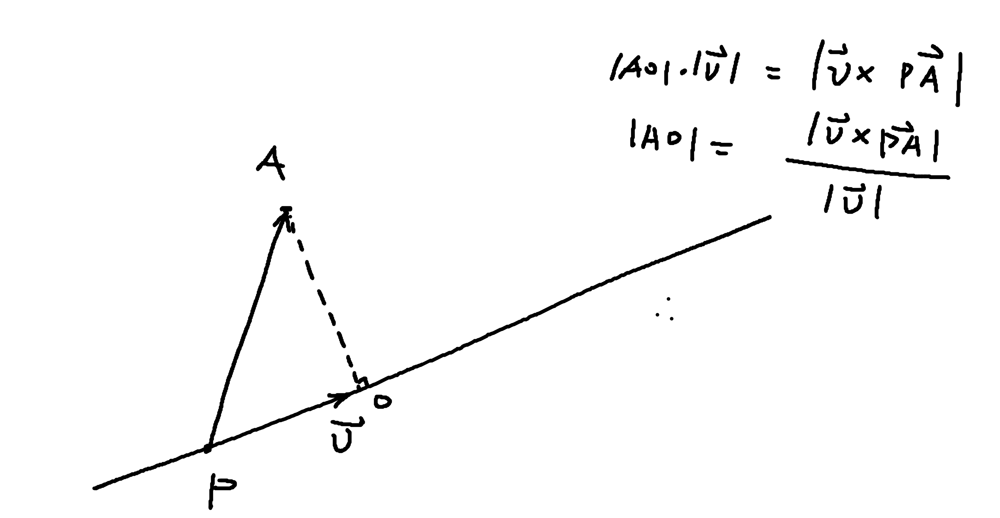
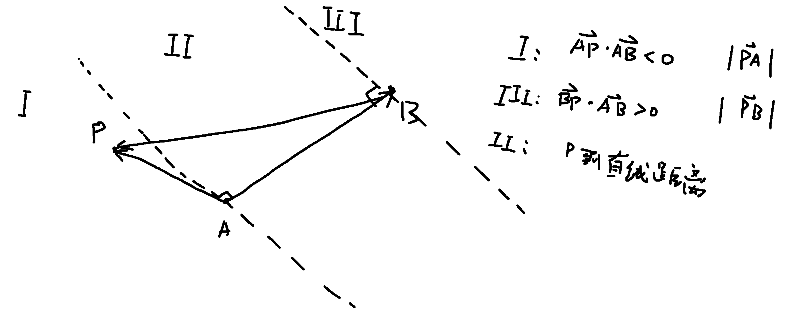
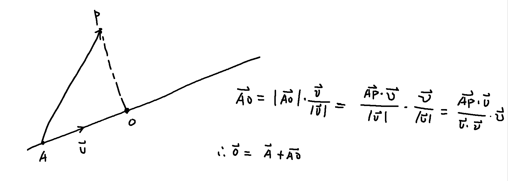
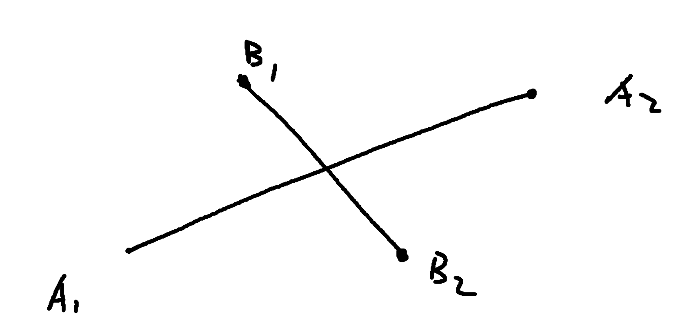
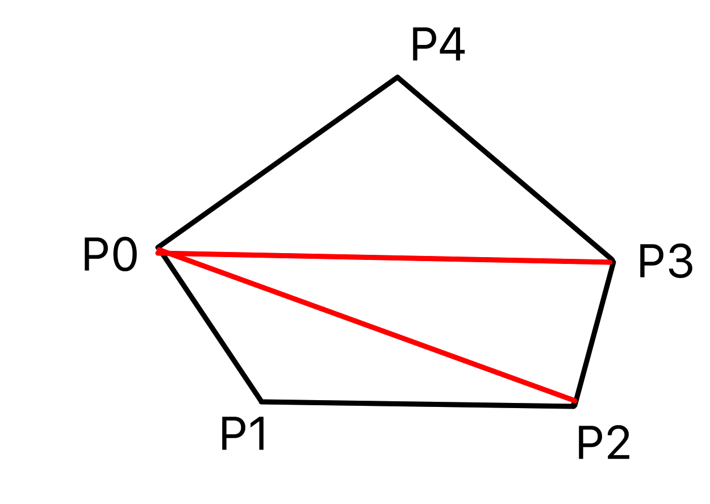
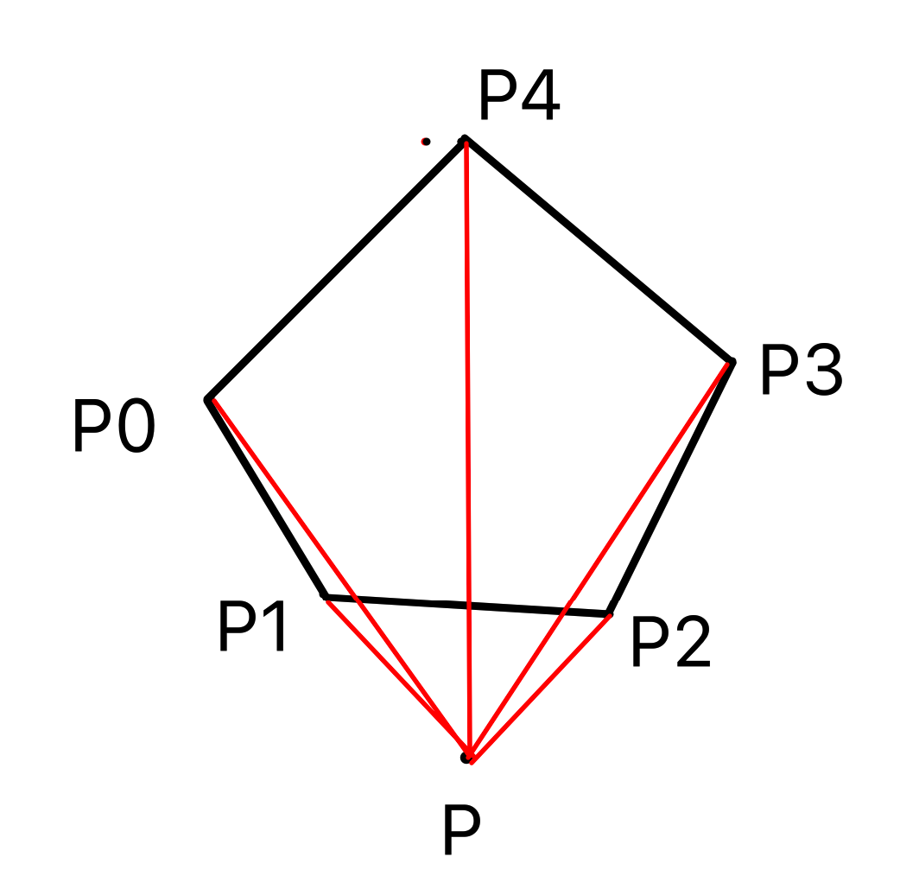
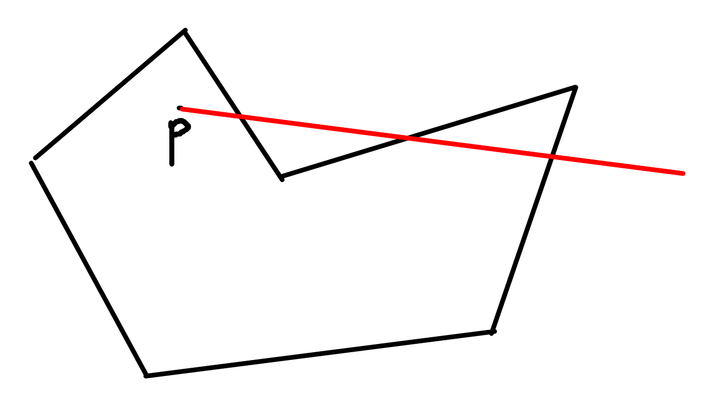

## 计算几何基础

### 1. 精度问题

想要得到$\pi$的较为精确的表示，可以使用如下代码

```c++
#include <cmath>
const PI = acos(-1);
```

浮点数比较相关，一般判定两个数是否相等只需要判断这两个数的差是否小于某个阈值即可。

```c++
#include <cmath>
const double eps = 1e-8; // 精度

// 返回x的符号，0表示0，-1表示负数，1表示正数
int sign(double x) {
  if (fabs(x) < eps) return 0;
  if (x < 0) return -1;
 	return 1;
}

// 比较两个浮点数的大小
int cmp(double x, double y) {
  return sign(x - y);
}
```

### 2. 向量相关

将某个矢量$(x, y)^T$逆时针旋转$\theta$得到的矢量为

$$\left(\begin{array}{ll}
\cos \theta & -\sin \theta \\
\sin \theta & \cos \theta
\end{array}\right)\left(\begin{array}{l}
x \\
y
\end{array}\right)=\left(\begin{array}{l}
x \cos \theta - y \sin \theta \\
x \sin \theta + y \cos \theta
\end{array}\right)$$

证明的话，其实比较简单，也就是原坐标系下的基地在新坐标系下的基地分别为$(\cos \theta, - \sin \theta)^T, (\sin \theta, \cos \theta)^T$

实现代码如下：

```c++
Point rotate(const Point &a, double angle) {
  return Point(a.x * cos(angle) - a.y * sin(angle), a.x * sin(angle) + y * cos(angle));
}
```

### 3. 点与直线

表示直线可以用两个变量，一个是直线上的任意一个点，第二个是这个直线的方向向量。其实向量也是两个维度，所以可以直接使用`Point`代替。既：

```c++
typedef Point Vector;
class Line {
public:
	Point p;
  Vector v;  
};
```

#### 3.1 判断点是否在直线上

设点为`A`，直线的表示为`P, V`，如果点在直线上，也就是向量$\overrightarrow{P A} \times \overrightarrow{V} = 0$。否则的话，上述表达式不为零。所以只需要判断两个矢量的外积即可。

#### 3.2 判断两直线是否相交

1. 首先对两个直线的方向矢量求外积，判断是否平行。
2. 然后求两个直线的交点。利用下面的证明，可以得到如下的公式：



```c++
Point get_line_intersection(Point p, Vector v, Point q, Vector w) {
  Vector u = p - q;
  double t = (w ^ u) / (v ^ w);
  return p + v * t;
}
```

#### 3.3 点到直线的距离

根据下面的推导可得如下代码

```c++
double point_line_distance(Point A, Point P, Vector v) {
  return fabs((A - P) ^ v) / v.getLength();
}
```




#### 3.4 点到线段的距离

按照P点所处的区域，分为以下几种情况。

1. AB共点，则之间返回`PA`的长度
2. $\overrightarrow{A P} \cdot \overrightarrow{A B}<0$，表示在区域`I`，直接返回`PA`的长度
3. $\overrightarrow{B P} \cdot \overrightarrow{A B}>0$，表示在区域`III`，直接返回`PB`的长度
4. 其它就位于区域`II`，则直接返回点到直线的距离即可。

```c++
double point_segment_distance(Point P, Point A, Point B) {
  if (A == B) return (P - A).getLength();
  Vector ab = B - A, ap = P - A, bp = P - B;
  if (sign(ab * ap) < 0) return ap.getLength();
  if (sign(ab * bp) > 0) return bp.getLength();
  return point_line_distance(P, A, A - B);
}
```



#### 3.5 点在直线上的投影

通过如下的推导，可以得到代码；

```c++
Point get_line_projection(Point P, Point A, Vector v) {
  return A + v * (((P - A) * v) / (v * v));
}
```




#### 3.6 判断点是否在线段上

在线段上需要满足两个条件：

1. $\overrightarrow{A P} \times \overrightarrow{B P}=0$
2. $\overrightarrow{A P} \cdot \overrightarrow{B P} \leq 0$

```c++ 
bool point_on_segment(Point P, Point A, Point B) {
  Vector ap = P - A, bp = P - B;
  return sign(ap ^ bp) == 0 && sign(ap * bp) <= 0;
}
```

#### 3.7 判断两个线段是否相交

跨域检测。主要是判断`B1, B2`是否在直线`A`的两侧，且`A1, A2`是否在直线`B`的两侧。

判断点是否在直线的两侧可以使用叉积来做，叉积符号相反就在两侧。

既：

1. $\left(\overrightarrow{A_{1} B_{1}} \times \overrightarrow{A_{1} A_{2}}\right) \cdot\left(\overrightarrow{A_{1} B_{2}} \times \overrightarrow{A_{1} A_{2}}\right) \leq 0$
2. $\left(\overrightarrow{B_{1} A_{1}} \times \overrightarrow{B_{1} B_{2}}\right) \cdot\left(\overrightarrow{B_{1} A_{2}} \times \overrightarrow{B_{1} B_{2}}\right) \leq 0$



```c++
bool segment_insection(Point A1, Point A2, Point B1, Point B2) {
  Vector a1a2 = A2 - A1, a1b1 = B1 - A1, a1b2 = B2 - A1;
  Vector b1b2 = B2 - B1, b1a1 = A1 - B1, b1a2 = A2 - B1;
  return sign(a1a2 ^ a1b1) * sign(a1a2 ^ a1b2) <= 0 && sign(b1b2 ^ b1a1) * sign(b1b2 ^ b1a2) <= 0;
}
```

### 4. 多边形

#### 4.1 三角形

面积公式:

1. 叉积
2. 海伦公式：

$$p = \frac{a + b + c}{2}, S = \sqrt{p * (p - a) * (p - b) * (p - c)}$$

三角形重心性质：

1. 到三角形顶点距离的平方和最小的点
2. 到三边距离之积最大的点

#### 4.2 普通多边形

通常按逆时针存储所有的点

> 凸多边形：过多边形的任意一边做一条直线，如果其他各个顶点都在这条直线的同侧，则为凸多边形。任意凸多边形外角和均为360度(转了一周)，内角和为(n - 2) * 180.

**常用函数**

1. 求凸多边形面积(非凸也可)

从第一个顶点出发，将凸多边形划分为`n - 2`个三角形，然后将三角形面积累加。



```c++
double polygon_area(Point p[], int n) {
  double s = 0;
  for (int i = 1; i + 1 < n; i ++) {
   	s += (p[i] - p[0]) ^ (p[i + 1] - p[i]);
  }
  return s / 2;
}
```

上述算法对于任意多边形，任意起始点都成立。



2. 判断点是否在多边形内(不一定是凸多边形)

- 射线法，从改点做一个和所有边都不平行的射线，然后统计该点和所有边的交点，为偶数则在多边形外，否则在多边形内。
- 转角法，枚举所有的点，然后看从p到这些点转动的角度是否是360。



3. 判断点是否在凸多边形内：只需要判断点是否在所有边的左边即可(逆时针存储多边形)

#### 4.3 皮克定理

一个计算点阵中顶点在格点上的多边形面积公式为$S = a + b / 2  -1$

- a表示多边形内部的点数
- b表示多边形边界上的点数
- S表示多边形面积

### 5 圆相关

主要是推公式。

### 6. 其它

余弦定理：

$$a ^ 2 = b ^ 2 + c^2 - 2bc\cos A$$


### 代码模板

[模板链接](BasicTemplate.cpp)

