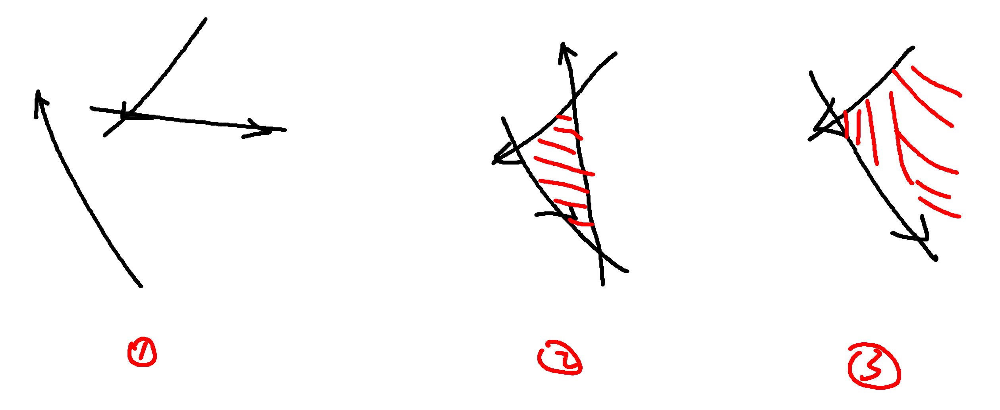
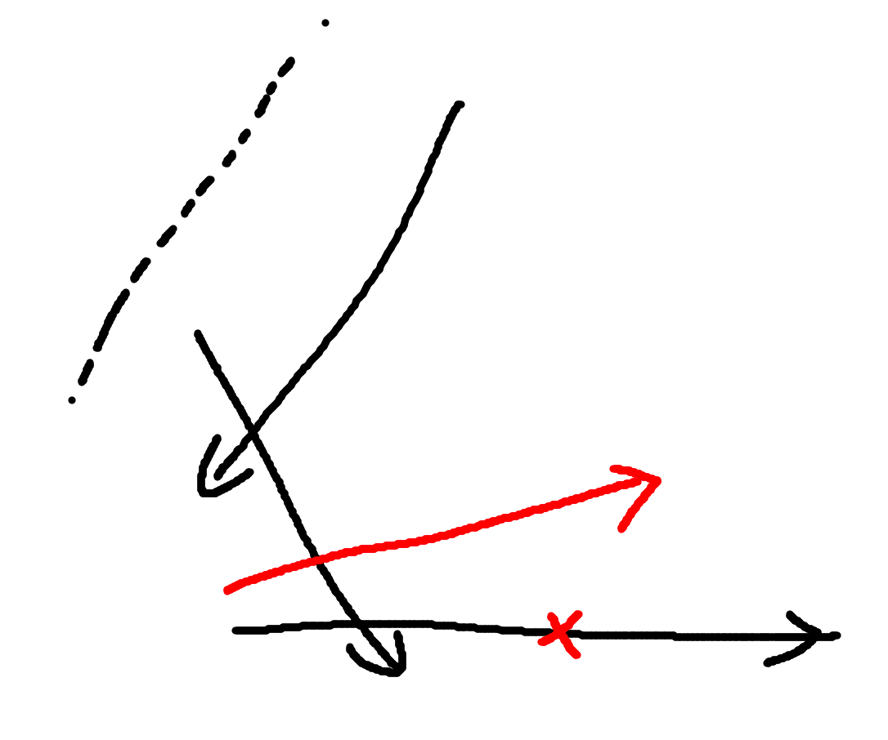
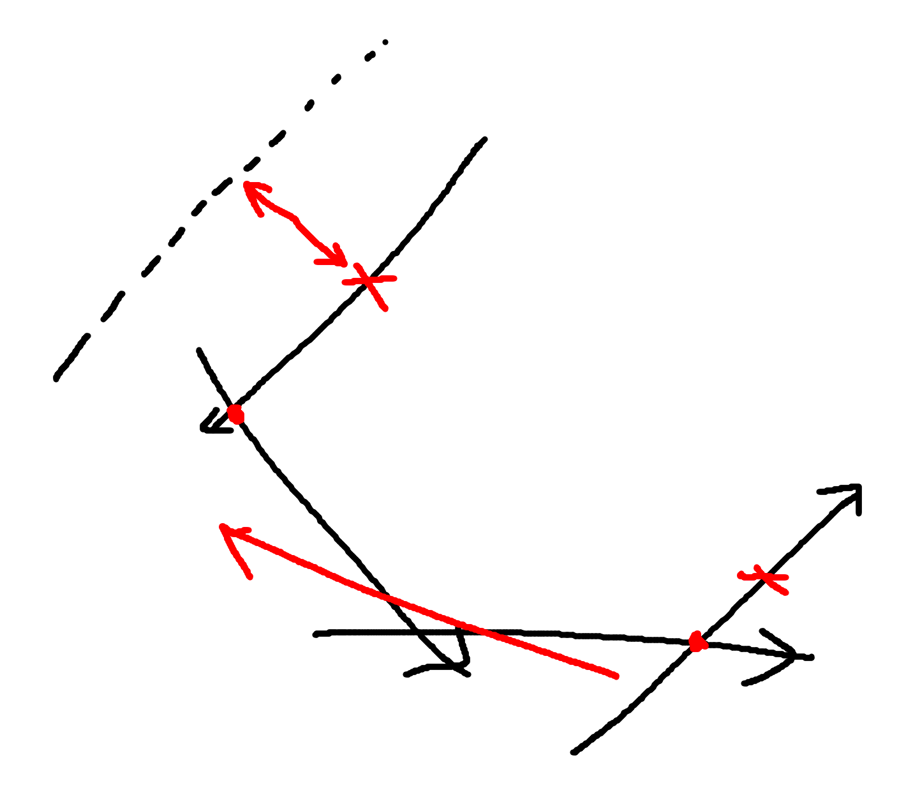
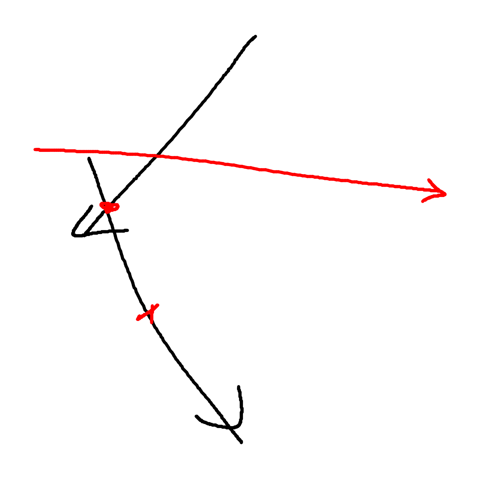
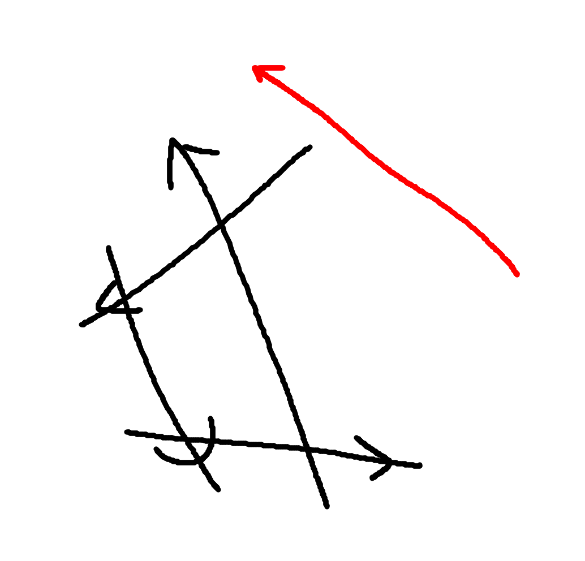
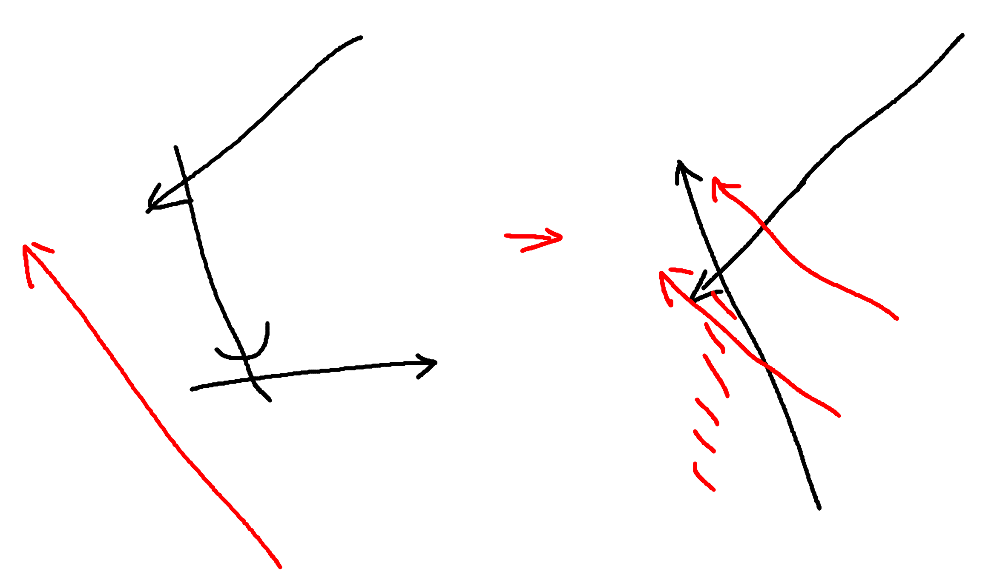

## 半平面交算法

半平面交算法主要解决的问题是，给定若干直线，求这些直线左半部分区域的交集组成的区域。

可能的答案分为三类：

1. 交集为空
2. 交集非空，且封闭
3. 交集非空，但是开发，面积无穷大

下图分别对应上面的三种情况

### 算法1

假如最终得到了一个凸的区域，那么这个区域的顶点一定是这些直线的交点组成的。在利用凸包的性质，我们知道这些点一定在所有直线的左侧。

所以我们可以枚举直线对的交点，然后判断交点是否在所有直线的左侧，如果是的话，就说明这个交点是关键点。最终判断那些是关键点即可。

最终对于第一种情况而言，没有点，所以很容易判断。

第二种情况和第三种情况，我们仅仅通过点无法判断出来。我们可以在得到所有点之后，利用Andrew算法求他们组成的凸包，然后判断凸包的每条边是不是都是原来的某条直线，如果存在一个边不是已有的直线，则说明这个是开的。

时间复杂度:

1. 判断点的话，为$O(n^3)$
2. 求凸包算法$O(n \log n)$
3. 判断是否有直线：$O(n^2)$

总时间复杂度为$O(n^3)$

### 算法2(求最终的区域为空或者封闭的)

算法2是一个基于增量的算法，首先我们将所有的直线按照他们的极角排序，对于方向相同的直线，我们只考虑左侧的那个直线。

然后我们按照极角从小到大的顺序枚举，并维护当前求的凸的区域。

由于极角是有序的，所以我们可以看到加入一条直线之后，有可能对当前区域带来哪些影响：

#### 1. 队列末尾有交点在直线左侧

这个时候需要逐步将队列末尾的元素删除，直到队列中只有一个元素，或者队列末尾两个直线的交点在新的直线的左侧。

#### 2. 队列开始有交点在左侧

这个时候需要不断的从队列头部删除元素，直到队列中只有一个元素或者队列开始的两个直线的交点在新的直线的左侧。这种情况只会发生在新的直线的角度绕过了队列开头的那个直线。

#### 3. 队列头和队列尾同时存在的话，先更新队列尾

如上面的情况，当只有一个交点的时候，先从头部更新就是错的。

#### 4. 结束的时候有队列投更新队列尾

如下面的情况

由于我们只能保证新加入的边会让之前的交点都在他的左侧，但是有可能出现上面的情况，但是对于上面这种情况，我们最后用队列头的元素去更新队列尾的交点，把交到右侧的删除即可。

#### 5. 交集为空的情况

如果存在交集为空的情况的话，我们可以看到当第一次出现空的时候，会将队列尾部的元素全部弹出，这个时候只剩下一个元素。然后我们后面再继续跑算法的时候，最终队列中只会留下两个点。所以最终我们求凸包的面积就是零。

[代码模板](half_plane_intersection.cpp)

