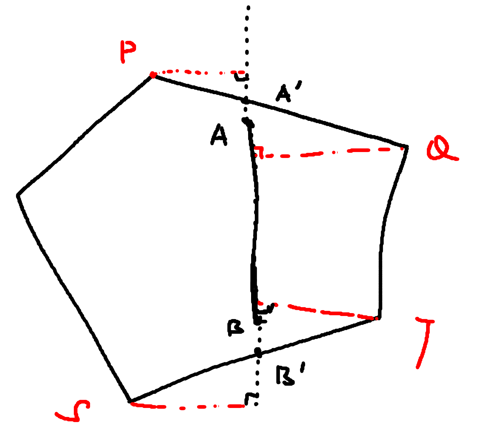
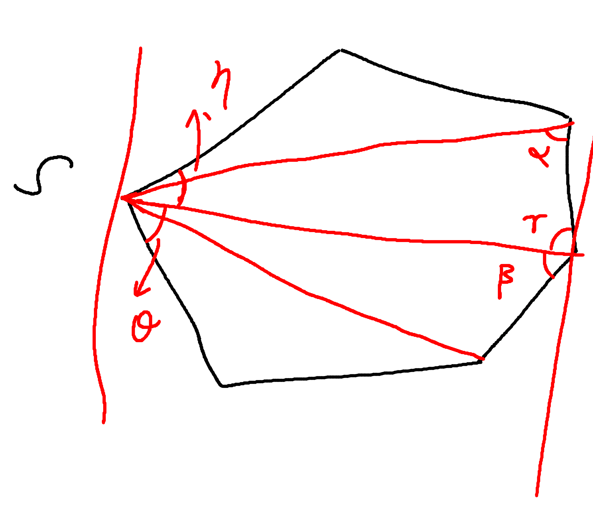

## 旋转卡壳

旋转卡壳是一种思想，一个具体的应用就是求凸包的直径，也就是凸包的最远点对。

首先我们证明凸包上的最远点对的点必然都在凸包的顶点上，使用的方法是反证法。如下图，假设最远点对不在顶点，

可以看出来，如果`AB`是最长的点对，那么可以延长`AB`使得其与某个边交于`PQ`于`A'`点，然后不难证明`PB`不小于`AB`。然后继续从`PB`出发，也可以把`B`放到一个顶点，使得长度不减。所以凸包内最远点对必然是凸包顶点对中的一个。所以只需要求凸包顶点对的距离的最大值即可。

旋转卡壳就是，用一组平行线去从两侧往中间平移，直到和凸多边形相切。切点被称为接踵点对。然后求出所有接踵点对之间的距离，其中的最大值就是要求的最大点对。下面证明对于任意点`S`，和它接踵的所有点中，必然存在着到它距离最远的顶点。

如下图所示，假设对于点`S`来说，距离其最远的点为`T`，则不难证明角$\gamma, \beta$必然是锐角。(反正，如果是钝角或者直角，则两侧的会更大)。

不难证明，$\theta, \eta$这两个角也是非钝角。所以我们从`S`和`T`分别做直线`ST`的切线，则必然之和凸包相切与这两点。所以这两点必然是切点的接踵点对。

所以现在的问题就是求所有平行线的接踵点对的最大距离即可。有无穷多对平行线，不能一一枚举，我们需要枚举一些离散值。

下面考察，所有平行线对和凸包的相切的情形：

1. 两个都切于一点
2. 一个切于一点，一个切于一个边
3. 两个都相切与边

对于第一种情况，只需要再将其逆时针旋转一个角度，使得某一个首先和凸包的边平行，则就转化为了第2或者第3种情况。所以我们只需要枚举第二种情况的，然后求顶点和边的左侧的那个点的距离，就是第一中情况的答案。

对于第二种情况，我们可以认为其有两个接踵点，但是右边的那个再稍微旋转一个小角度之后，就会转为第一种情况，然后再继续旋转还是可以归约为第二种情况，用左侧的点去更新。

对于第三种情况，可以认为有四对接踵点，但是对角线的最大值一定是四条的最大值，所以我们只需要求交叉的两对即可。

这几种情况都可以归约为：

1. 枚举所有的凸多边形的边，然后找到其余到这条边距离最远的第一个点（第一个确保第三种情况也纳进来了）。
2. 然后求距离最远的点和边左侧点的距离，维护最大值。

由于在旋转的过程总，下一个边的距离最远的点一定在当前边最远点的后面，(也可以利用凸性，单峰的)，所以可以利用类似双指针的算法来进行求解，时间复杂度为$O(n)$，在判断最远点的时候，可以利用三角形面积，将距离比较转为面积比较。

[代码模板](rotating_calipers.cpp)

#### 参考文献

[博客](https://jvruo.com/archives/79/)

