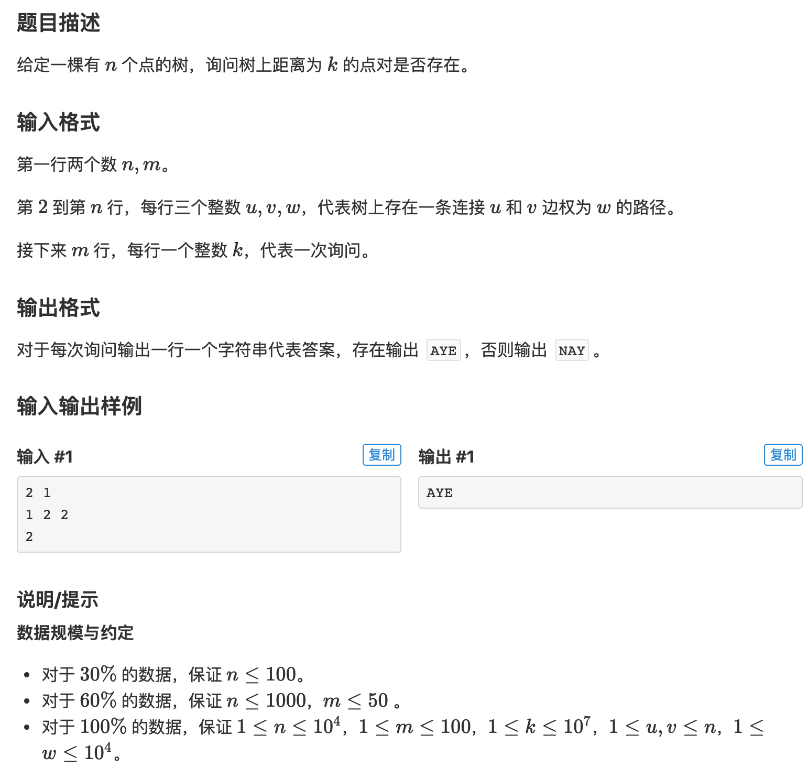

## 点分治

点分治算法一般适合处理**大规模**的树上路径信息问题。

比如找到树上所有满足特定条件的点对问题。这个条件是加到这两个点之间的路径上的。

直观来看这个问题需要枚举任意两点之间的距离，然后进行求解。

如果枚举起点，然后进行遍历的话，时间复杂度是$O(n^2)$，一般是不能够满足要求的。

点分治算法能够比较高效的扫描树上任意两点之间的路径信息。

### 01 算法原理

其实算法原理非常简单。

假设当前树的根节点为`root`，那么我们可以先将树上所有的路径分为两类：

1. 路径经过了`root`
2. 路径没有经过`root`

对于经过`root`的路径，其两个端点必然在`root`的两个不同的子树中，或者为`root`。

在处理完所有经过`root`的路径之后，我们可以递归地处理`root`的每个子树。这样就能够得到所有的路径。

这里的`root`选择是非常关键的。如果树是一个链，而且我们选择链的一个端点作为根。

以经典的统计所有经过`root`的路径的时间复杂度为`O(n)`而言，我们有如下的关系

$$T(N) = T(N - 1) + O(N)$$

算法的时间复杂度退化到了$O(n^2)$。这非常糟糕。

而如果我们选择链的中点来处理的话，有如下的关系：

$$T(N) = 2 * T(\frac{N}{2}) + O(N)$$

算法时间复杂度为$O(n\log(n))$。有此可见根的选择对于算法的复杂度影像非常大。

这里一般选择树的重心作为根节点。

> 树的重心是指以其为根，则其所有孩子的最大节点数最小

下面证明树重心的任意一个孩子的节点数不超过树总节点数的一半。

采用反证法，假设其某个孩子的节点数超过了树总节点数的一半，记这个孩子的根为`v`,那么有$size(v) > \frac{n}{2}$，所以除了`v`这个子树之外，其它所有节点数一定小于$\frac{n}{2}$,这个时候我们选择`v`作为根的话，那么`v`的所有孩子的最大节点数最大为$size(v) - 1$，这个是比`root`的孩子的最大节点数小的，这就不满足`root`为根的定义了。

所以每次递归之后，子问题规模不超过原问题的一半，递归深度就为$\log(n)$，所以时间复杂度能够保证为$n\log(n)$

###02 算法框架

点分治算法有一个基本的框架，但是具体的函数如何实现需要根据具体问题来具体分析。

点分治的算法思想不难，但是代码并不是很好写。

代码的几个注意事项：

1. `solve`函数是处理`u`所在的子树，而不是`u`为根，在每个`solve`内部需要重新计算这个树的根。
2. 在计算完根之后，需要重新跑一遍`get_size`方法，才能正确求出`root`每个子树的节点个数
3. 递归处理每个子树的时候，都要**重新求一下这个子树的根**，而不是用上一次得到的结构来做。
4. 在将`rec2`中元素加到主栈中时，需要注意判断大小，防止数组越界。
5. 在`get_dis`中其实可以加一个优化，如果发下当前节点`dis`已经超过了要询问的最大值，则可以直接返回
6. 不可以用`memset`，要手动清空。(手动清空不会提高复杂度的量级)

以[模板题](https://www.luogu.com.cn/problem/P3806)为例



下面是这道问题的代码，讲解见具体注释

```c++
/**
 *
 * https://www.luogu.com.cn/problem/P3806
 * 点分治模板题
 *
 */

#include <iostream>
#include <cstring>

using namespace std;

const int N = 2e4 + 5, M = 2 * N, MAX_K = 1e7, MAX_QUERY_NUM = 105;

int h[N], e[M], ne[M], w[M], idx;  // 存储图
int query[MAX_QUERY_NUM];  // 存储每个询问
bool ans[MAX_QUERY_NUM]; // 存储答案
int sz[N], max_child[N];  // 存储每棵子树的大小，还要其最大孩子的大小
int root, cur_tree_size;  // 记录当前在处理的树的根节点和当前树的节点个数
bool vis[N], judge[MAX_K];  // vis表示这个节点是否被删掉了，judge数组用于记录前面子树已经出现过的路径长度
int rec[N], top;  // 总的栈，维护已经遍历过的子树中存在的路径长度
int rec2[N], top2;  // 临时站，维护当前遍历的子树总存在的路径长度
int dis[N];  // 存储节点到根的路径的长度


int n, m;


void add(int a, int b, int c) {
    e[idx] = b, ne[idx] = h[a], w[idx] = c, h[a] = idx ++;
}

// 求当前子树的根的算法
void get_root(int u, int fa) {
    
    sz[u] = 1, max_child[u] = 0;
    for (int i = h[u]; ~i; i = ne[i]) {
        int node = e[i];
        if (node == fa || vis[node]) continue;
        get_root(node, u);
        sz[u] += sz[node];
        max_child[u] = max(max_child[u], sz[node]);
    }
    max_child[u] = max(max_child[u], cur_tree_size - sz[u]);
    if (max_child[u] < max_child[root]) root = u;
}

// 求每个节点到root的距离
void get_dis(int u, int fa) {
    
    for (int i = h[u]; ~i; i = ne[i]) {
        int node = e[i];
        if (node == fa || vis[node]) continue;
        dis[node] = dis[u] + w[i];
        rec2[top2 ++] = dis[node];
        get_dis(node, u);
    }
}

// 计算所有经过根节点的路径
void calc() {
    
    dis[root] = 0;
    for (int i = h[root]; ~i; i = ne[i]) {
        int node = e[i];
        if (vis[node]) continue;
        dis[node] = w[i];
        rec2[top2 ++] = dis[node];  // 将当前子树的所有路径临时存储在rec2中，这样是为了避免枚举的时候，出现在一个子树中枚举两个要拼接的路径
        get_dis(node, root);
        
        // 扫描所有的询问，并看是否有两个路径拼接起来满足要求
        for (int j = 0; j < top2; j ++) {
            for (int k = 1; k <= m; k ++) {
                int t = query[k] - rec2[j];
                if (t >= 0) ans[k] |= judge[t];
            }
        }
        
        // 将临时栈rec2中的元素放到总栈rec中，并维护judge数组
        for (int j = 0; j < top2; j ++) {
            if (rec2[j] <= 1e7 && !judge[rec2[j]]) rec[top ++] = rec2[j], judge[rec2[j]] = true; 
        }
        top2 = 0;  // 清空临时栈，用于枚举下一个子树
    }
   
    // 当前根的所有路劲都枚举完了，清空总栈，并清空judge数组 
    for (int i = 0; i < top; i ++) judge[rec[i]] = false;
    top = top2 = 0;
    
}

void get_size(int u, int fa) {
    sz[u] = 1;
    for (int i = h[u]; ~i; i = ne[i]) {
        int node = e[i];
        if (node == fa || vis[node]) continue;
        get_size(node, u);
        sz[u] += sz[node];
    }
}

// 解决u所在的子树
void solve(int u) {
    
    root = 0;
    max_child[0] = 2e9;
    
    get_root(u, 0);  // 先求出u所在子树的根
    
    calc();  // 统计所有经过根的路径
    
    // cout << root << endl;
    // for (int i = 1; i <= m; i ++) cout << ans[i] << ' ';
    // cout << endl;
    
    // 将root置为删除
    vis[root] = true;
    // 重新计算以root为根的每个子树的大小
    get_size(root, 0);


    for (int i = h[root]; ~i; i = ne[i]) {
        int node = e[i];
        if (vis[node]) continue;
        cur_tree_size = sz[node];  // 正确赋值node所在子树的节点总数
        solve(node); // 递归处理node所在的子树
    }
    
}


int main() {
    
    ios::sync_with_stdio(false);
    cin.tie(nullptr);
    cout.tie(nullptr);
    
    memset(h, -1, sizeof h);
    cin >> n >> m;
    for (int i = 1; i < n; i ++) {
        int a, b, c;
        cin >> a >> b >> c;
        add(a, b, c);
        add(b, a, c);
    }
    
    for (int i = 1; i <= m; i ++) cin >> query[i];
    
    // 初始化操作
    judge[0] = true;
    cur_tree_size = n;
    solve(1);
    
    for (int i = 1; i <= m; i ++) {
        if (ans[i]) cout << "AYE" << '\n';
        else cout << "NAY" << '\n';
    }
    return 0;   
}

```

### 03 其它题

[点分治+线段树](https://www.luogu.com.cn/problem/P4178)

#### 参考文献

[点分治学习笔记](https://www.cnblogs.com/bztMinamoto/p/9489473.html)

[oi-wiki 树分治](https://oi-wiki.org/graph/tree-divide/)

