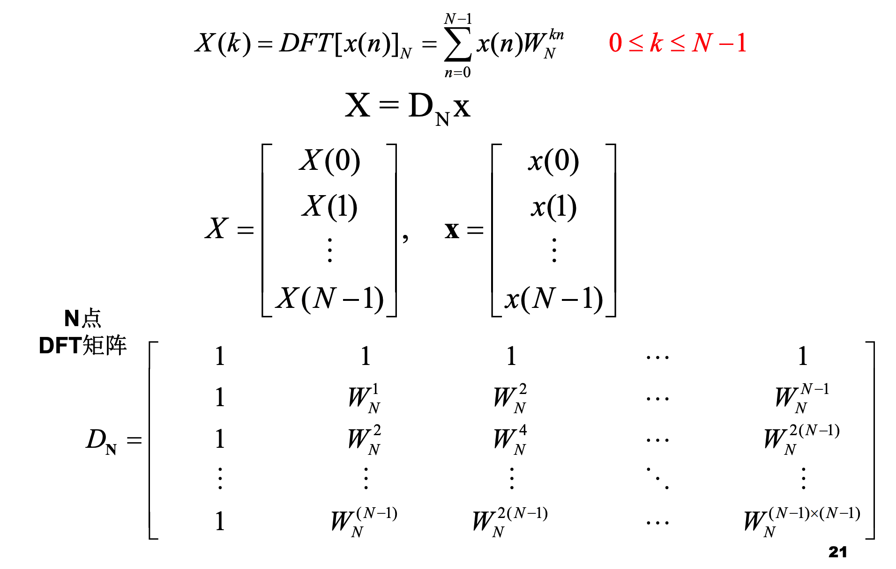
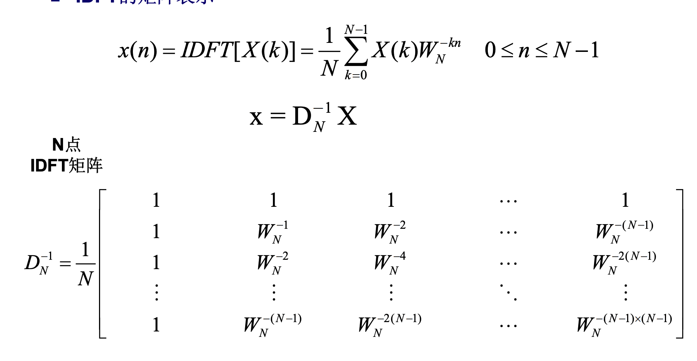
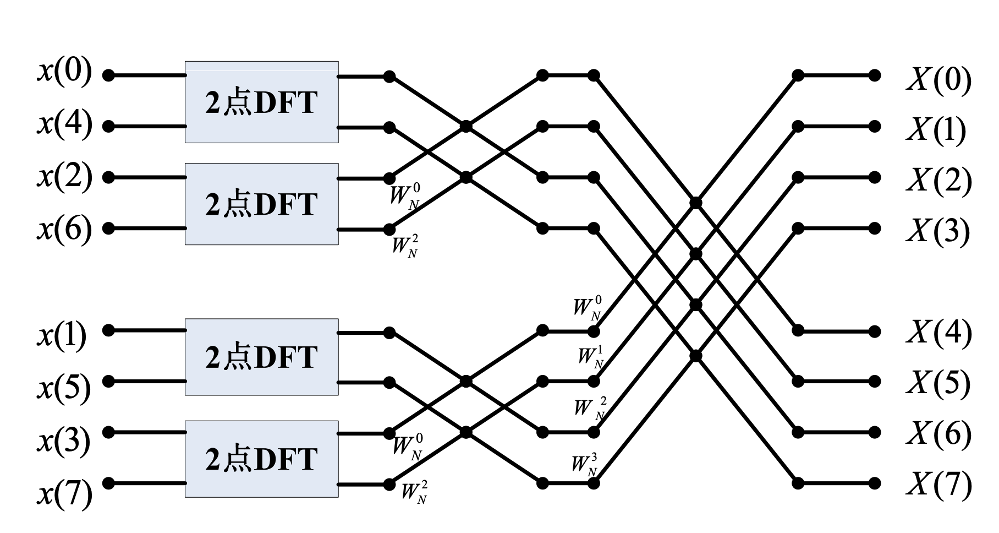
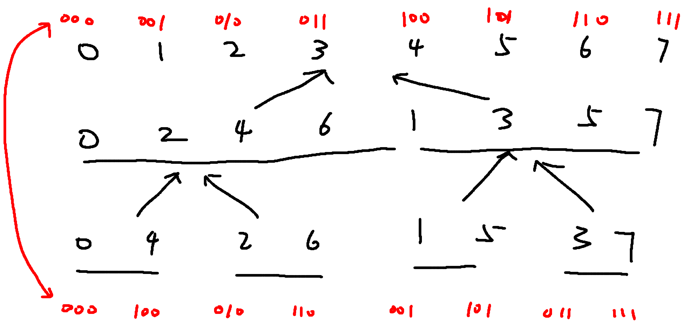
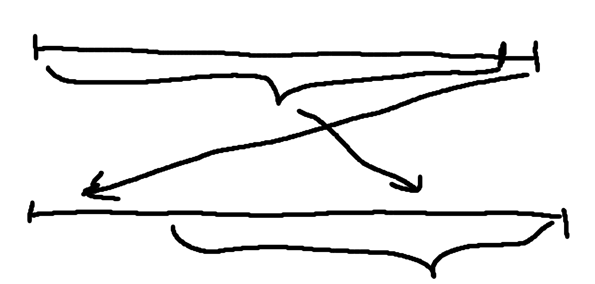

## FFT

FFT是用来快速求卷积的操作。对于有限离散信号而言，假设`a`信号的长度为`n`,`b`信号的长度为`m`，那么两者卷积的信号的长度为`n + m - 1`。

朴素的求卷积的暴力方法时间复杂度为$O(n ^ 2)$,通过时域卷积为谱域相乘，可以先将两个信号利用FFT得到谱域表示，然后乘起来，再利用IFFT得到卷积之后的序列。

具体的操作步骤如下：

1. 将两个信号通过补零的方式增加到不小于`n + m - 1`的最小的二的整数次幂的长度
2. 利用FFT算法，求得两个信号的频谱，将频谱相乘
3. 再利用IFFT，输出前`n + m - 1`项，既为卷积之后的序列

### 01 离散时间傅里叶变换

对于长度为`n`的信号$x[0.. N - 1]$，其变换结果为：

$$X[k] = \sum_{n=0}^{N-1} x[n] * e^{- \omega_k * n}, \omega_k = \frac{2 \pi}{N} * k, 0 \le k \le N - 1$$

定义$W_N^k = e^{- \omega_k}$

写成矩阵的形式，就是如下的结果：



可以看做求当前信号在新的坐标空间下的表示。由于这组基底是正交的，所以其你变换就是如下的情况：



可以看到，这两个变换其实差别就是一正一负。

### 02 FFT

直接暴力求解上述矩阵时间复杂度为$O(n^2)$。FFT通过利用负数的一些特性实现了$O(n \log n)$的算法。

首先我们观察$X[k]$的求解过程。

$$X[k] = \sum_{n=0}^{N-1}x[n]W_N^{kn} = \sum_{n=0}^{\frac{N}{2} - 1} x[2n]W_{N}^{2kn} + \sum_{n=0}^{\frac{N}{2} - 1}x[2n+1]W_{N}^{2kn+k} $$ 

$$ = \sum_{n=0}^{\frac{N}{2} - 1} x[2n]W_{N}^{2kn} + W_N^k\sum_{n=0}^{\frac{N}{2} - 1}x[2n+1]W_{N}^{2kn}  = \sum_{n=0}^{\frac{N}{2} - 1} x[2n]W_{\frac{N}{2}}^{kn} + W_N^k\sum_{n=0}^{\frac{N}{2} - 1}x[2n+1]W_{\frac{N}{2}}^{kn} $$

可以看到，求$x[n]$的`N`点傅里叶变换，只需要分别求出偶数项和计数项的$\frac{N}{2}$点的傅里叶变换即可。

我们再看下面一个推导：

$$X[k + \frac{N}{2}] = \sum_{n=0}^{N-1}x[n]W_N^{kn + \frac{Nn}{2}} = \sum_{n=0}^{N-1}x[n]W_N^{kn} (-1)^n$$

可以看到，差为$\frac{N}{2}$的两项，其偶数部分不变，奇数部分为符号，而上面刚好就分别计算出来了奇偶两部分的值。所以就有了下面大名鼎鼎的蝶形图。


按照上面的思路，对于$N$个点的信号，我们要求其$N$个点的傅里叶变换，只需要将奇偶分别列出来，然后求出他们的$\frac{N}{2}$个点的傅里叶变换，再利用上面的蝶形图，就可以求出要的答案。

$$f(n) = 2 * f(\frac{n}{2}) + O(n)$$

由主定理可知，其时间复杂度为$O(n \log n)$

下面是一个8点FFT的例子：



### 03 迭代算法

如果直接利用上面的递归的算法的话，每次都要将奇偶抽出来，然后再合并，常数较大。可以利用下面的方法来进行自底向上的计算。

下面是8个点的示意图。



通过对整个递归树画出来，可以看到，如果自底向上地进行求解的话，需要将输入的序列按照最后一层的下标进行重排，然后再按照区间的长度，逐次二倍信号长度即可。那么这种重排有没有规律呢。当然你可以说我们把他们对应的二进制表示写出来，然后惊奇地发现互为逆序！下面对这个进行一个证明：

首先对于第一层划分，我们按照数字的最后一位是0还是1进行了重排，0的放左侧，1放右侧。而这一次重排，右半部分下标的最高位都将是1，左半部分的下表的最高位都是0.这就实现了旧索引的最低位和新索引的最高位的对应关系，然后依次类推，考虑旧索引的倒数第二位和新索引的次高位，就可以得到上面的结论。

所以我们可以先求出来旧位置下标和新位置下标之间的映射关系，然后对输入的信号进行重排，然后跑一遍自底向上的算法，然后就可以得到答案！

### 04 算法实现

首先要解决的问题是，如何快速得到新旧下标之间的映射关系？可以通过迭代的方法。

```c++
inv[i] = (inv[i >> 1] >> 1) | ((i \& 1) << (bit - 1))
```

其中`bit`表示所有下标的二进制表示的位数。原理见下图：即对于长度为`bit`的二进制数进行反转，只需要将得到其前`bit - 1`位反转的结果，拼上自己最后一位向左移`bit-1`位即可。



正逆变换的区别：

从上述推导我们可以看出，正逆变换就是使用的信号的辅角正负相反，所以我们直接将蝶形图的$W_N^k$ 替换为$W_N^{-k}$即可。

然后就是进行FFT的部分的代码：

```c++
#include <iostream>
#include <cstring>
#include <algorithm>
#include <cmath>

using namespace std;

const int N = 300010;
const double PI = acos(-1);

int n, m;
struct Complex
{
    double x, y;
    Complex operator+ (const Complex& t) const
    {
        return {x + t.x, y + t.y};
    }
    Complex operator- (const Complex& t) const
    {
        return {x - t.x, y - t.y};
    }
    Complex operator* (const Complex& t) const
    {
        return {x * t.x - y * t.y, x * t.y + y * t.x};
    }
}a[N], b[N], w[N];
int rev[N], bit, tot;

void fft(Complex a[], int inv)
{
  	// 将信号放到对应的位置
    for (int i = 0; i < tot; i ++ )
        if (i < rev[i])  // 只能交换一次
            swap(a[i], a[rev[i]]);  
    w[0] = Complex({1, 0});
    // 枚举要处理的长度的一半
    for (int mid = 1; mid < tot; mid <<= 1)
    {
        // 预处理好所有段都需要的W_N^k
        auto w1 = Complex({cos(PI / mid), inv * sin(PI / mid)}); // inv来确定采用的信号的辅角的正负，从而同时实现正逆变换
        for (int i = 1; i < mid; i ++) w[i] = w[i - 1] * w1;
        // 枚举所有长度为2 * mid的段
        for (int i = 0; i < tot; i += mid * 2)
        {   // 枚举段中的一半长度
            for (int j = 0; j < mid; j ++)
            {
                // 成对地更新元素
                auto x = a[i + j], y = w[j] * a[i + j + mid];
                a[i + j] = x + y, a[i + j + mid] = x - y;
            }
        }
    }
}

int main()
{
    scanf("%d%d", &n, &m);
    for (int i = 0; i <= n; i ++ ) scanf("%lf", &a[i].x);
    for (int i = 0; i <= m; i ++ ) scanf("%lf", &b[i].x);
    // 得到不小于卷积结果长度的最小的2的幂次
    while ((1 << bit) < n + m + 1) bit ++;
    tot = 1 << bit;
    // 得到新旧下标的映射关系
    for (int i = 0; i < tot; i ++ )
        rev[i] = (rev[i >> 1] >> 1) | ((i & 1) << (bit - 1));
    fft(a, -1), fft(b, -1);  // 逆变换
    for (int i = 0; i < tot; i ++ ) a[i] = a[i] * b[i];
    fft(a, 1);  // 正变换
    for (int i = 0; i <= n + m; i ++ )
        printf("%d ", (int)(a[i].x / tot + 0.5));  // 注意结果要除以N，还有浮点数误差

    return 0;
}
```

### 参考文献

[课件](https://web.xidian.edu.cn/kywang/files/20171213_190241.pdf)

[题目](https://www.acwing.com/problem/content/3125/)