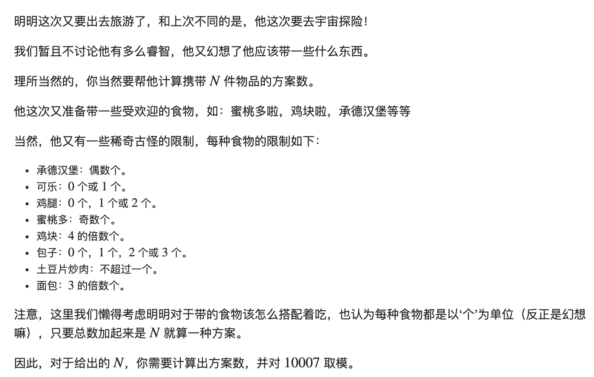

## 生成函数

生成函数是利用多项式乘法来表示计数原理中的乘法公式，进而将计数问题转化为多项式的相关问题。一般是将一个物品的选择方法写作一个多项式，然后将多个多项式乘起来，化简即可。

比如`a`物品可以选择1个有3种选法，选择2个有4种选法，`b`物品可以选择2个有4中方法，选择3个5种方法，问一共选择4个物品，有几种方法?

`a`的生成函数为$3x + 4*x^2$, `b`的生成函数为$4 * x ^2 + 5 * x ^ 3$

然后将两个多项式乘起来，得到的为

$$(3x + 4x^2) (4x^2 + 5x^3) = 12x^3 + 31x^4 + 20x^5$$

观察$x^4$的系数，所以一共有31种方法。

#### [例题](https://www.acwing.com/problem/content/3135/)

首先写出各个物品的生成函数：

$$G(x) = \frac{1}{1 - x^2}(1 + x) (1 + x + x^2)\frac{x}{1-x^2}\frac{1}{1-x^4}(1+x+x^2+x^3)(1+x)\frac{1}{1-x^3}$$

$$ = \frac{x}{(1-x)^4}$$

下面对$\frac{1}{(1-x)^k}$进行讨论。

可以看做出`k`种物品，每个物品可以选择任意多个，求去n个物品的个数。使用挡板法不难得到答案为$C_{n+k-1}^{k-1}$

所以有

**$$\frac{1}{(1-x)^k} = \sum_{n=0}^{ \infin} C_{n+k-1}^{k-1}x^n$$**

所以上述问题的答案就是$x^{N-1}$的系数，既$C_{N + 2}^{3}$

