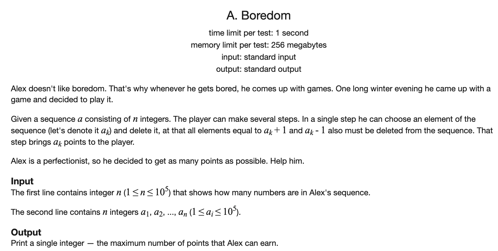
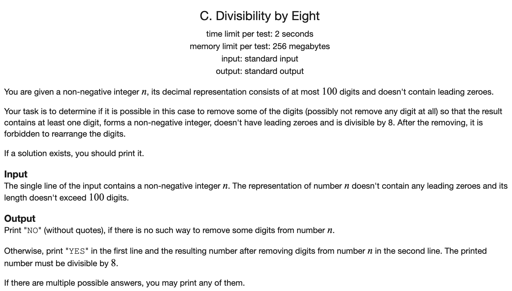
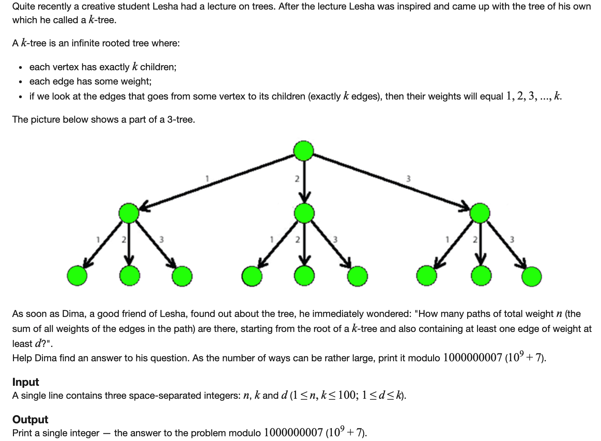
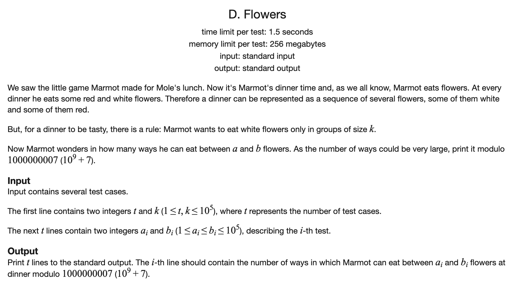
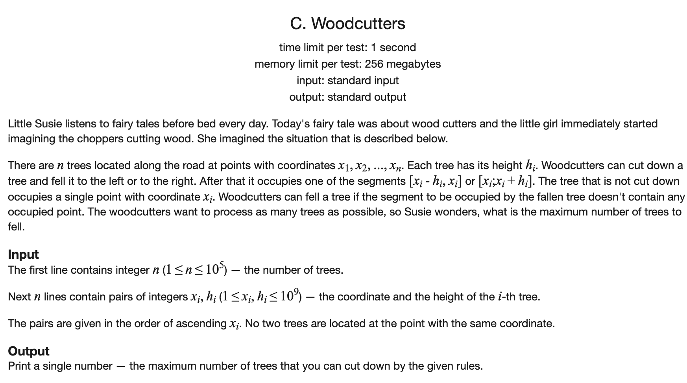

[toc]

### 1. Boredom

[原题链接](https://codeforces.com/problemset/problem/455/A)



#### 解题思路

考虑解决问题的顺序，由于所有的数字的大小在`1 - 1e5`之间，设`dp[i]`为考虑大小在`1 - i`范围的数的最大分数，则可以分为两类：

- 选`i`，则最大为`dp[i-2] + i * cnt[i]`
- 不选i，则最大为`dp[i-1]`

所以有`dp[i] = max(dp[i-1], dp[i-2] + i * cnt[i])`

最后输出`dp[100000]`即可。

#### C++代码

```c++
#include <iostream>
#include <cstring>
using namespace  std;

const int N = 1e5 + 10;
int cnt[N];
long long dp[N];
int ans = 0;
int n;

int main() {

    memset(cnt, 0, sizeof cnt);
    cin >> n;
    while (n --) {
        int a;
        cin >> a;
        cnt[a] ++;
    }
    dp[1] = cnt[1];
    for (int i = 2; i <= 1e5; i ++) dp[i] = max(dp[i-1], dp[i-2] + (long long)cnt[i] * i);
    cout << dp[100000];
    return 0;
}
```

### 2. Divisibility by Eight

[原题链接](https://codeforces.com/problemset/problem/550/C)



#### 解题思路

方法1.考虑1000可以被8整除，所以只需要找位数为1， 2，3的是否存在被8整除的即可。然后可以分别扫描三次循环。时间复杂度为$O(n^3)$， $n$为长度。

方法2.动态规划。我们考虑长度为`i`的串的问题，那么如果其存在可以被8整除的方案，则可以分为两类：

- 方案中包含最后一个数字
- 方案中不包含最后一个数字

如果方案中包含最后一个数字，那么前面`i-1`个需要存在除8余`k`的方案，且`k * 10 + dig[i]`能够被8整除。

所以记录`dp[i][j]`, j取0-7表示前`i`个数字是否存在除8余j的方案，且还需要一个数组记录下来这个方案是谁。

然后进行状态转移即可。时间复杂度为`O(n)`

发现可以使用滚动数组进行优化。

#### C++代码

```c++
// 方法1
#include <iostream>
#include <vector>
using namespace std;


int work(string& s) {


    vector<int> digits;
    for (auto x : s) digits.push_back(x - '0');
    int n = digits.size();

    for (int i = 0; i < n; i ++) {
        if (digits[i] % 8 == 0) return digits[i];
        for (int j = i + 1; j < n; j ++) {
            if ((digits[i] * 2 + digits[j]) % 8 == 0) return digits[i] * 10 + digits[j];
            for (int k = j + 1; k < n; k ++) {
                if ((digits[i] * 4 + digits[j] * 2 + digits[k]) % 8 == 0) return digits[i] * 100 + digits[j] * 10 + digits[k];
            }
        }
    }
    return -1;
}


int main() {

    string s;
    cin >> s;
    int ans = work(s);
    if (ans == -1) cout << "NO";
    else {
        cout << "YES" << endl << ans;
    }
    return 0;

}

// 方法2
#include <iostream>
#include <vector>
#include <cstring>
using namespace std;

const int N = 1e5 + 10;
bool dp[N][8];
int pre[N][8];

int work(string& s) {


    vector<int> digits;
    for (auto x : s) digits.push_back(x - '0');
    int n = digits.size();
    dp[0][0] = true;
    for (int i = 0; i < n; i ++) {
        for (int j = 0; j < 8; j ++) {
            if (j == 0) continue;
            else {
                if (dp[i][j]) {
                    dp[i + 1][j] = true;
                    pre[i + 1][j] = pre[i][j];
                }
            }

        }
        for (int j = 0; j < 8; j ++) {
            if (dp[i][j]) {
                int t = (j * 10 + digits[i]) % 8;
                if (!dp[i + 1][t]) {
                    dp[i + 1][t] = true;
                    pre[i + 1][t] = pre[i][j] * 10 + digits[i];
                }
            }
        }
        if (dp[i + 1][0]) return pre[i + 1][0];
        else dp[i + 1][0] = true;
    }
    return -1;

}


int main() {

    string s;
    cin >> s;
    int ans = work(s);
    memset(dp, false, sizeof dp);
    if (ans == -1) cout << "NO";
    else {
        cout << "YES" << endl << ans;
    }
    return 0;

}

// 方法2，滚动数组
#include <iostream>
#include <vector>
#include <cstring>
using namespace std;

const int N = 1e5 + 10;
bool dp[2][8];
int pre[2][8];

int work(string& s) {


    vector<int> digits;
    for (auto x : s) digits.push_back(x - '0');
    int n = digits.size();
    dp[0][0] = true;
    for (int i = 0; i < n; i ++) {
        dp[(i + 1) % 2][0] = false;
        for (int j = 0; j < 8; j ++) {
            if (j == 0) continue;
            else {
                if (dp[i % 2][j]) {
                    dp[(i + 1) % 2][j] = true;
                    pre[(i + 1) % 2][j] = pre[i % 2][j];
                }
            }

        }
        for (int j = 0; j < 8; j ++) {
            if (dp[i % 2][j]) {
                int t = (j * 10 + digits[i]) % 8;
                if (!dp[(i + 1) % 2][t]) {
                    dp[(i + 1) % 2][t] = true;
                    pre[(i + 1) % 2][t] = pre[i % 2][j] * 10 + digits[i];
                }
            }
        }
        if (dp[(i + 1) % 2][0]) return pre[(i + 1) % 2][0];
        else dp[(i + 1) % 2][0] = true;
    }
    return -1;

}


int main() {

    string s;
    cin >> s;
    int ans = work(s);
    memset(dp, false, sizeof dp);
    if (ans == -1) cout << "NO";
    else {
        cout << "YES" << endl << ans;
    }
    return 0;

}
```

### 3. k-tree

[原题链接](https://codeforces.com/problemset/problem/431/C)



#### 解题思路

首先考虑第一步的情况。

- 如果第一步走的权重比`d`小，那么这种走法对应的方案就要求剩下的中包含至少一个比`d`大的。
- 如果第一步走的权重比`d`大，那么剩下的包不包含比`d`大的都无所谓

所以定义`dp[i][0]`表示和为`i`，且不包含至少为`d`的方案数。`dp[i][1]`表示和为`i`,且包含至少一个`d`的方案数。

然后就可以利用第一步的权重进行分类，就可以得到状态转移方程了。

#### C++代码

```c++
#include <iostream>
using namespace std;

const int N = 110;
const int MOD = 1e9 + 7;
int dp[N][2];


int main() {

    int n, k, d;
    cin >> n >> k >> d;
    dp[0][0] = 1;
    dp[0][1] = 0;
    for (int i = 1; i <= n; i ++) {
        for (int j = 1; j <= min(i, d - 1); j ++) {
            dp[i][0] += dp[i-j][0];
            dp[i][0] %= MOD;
        }
        for (int j = 1; j <= min(i, k); j ++) {
            if (j >= d) {
                dp[i][1] += dp[i-j][0];
                dp[i][1] %= MOD;
                dp[i][1] += dp[i-j][1];
                dp[i][1] %= MOD;
            } else {
                dp[i][1] += dp[i-j][1];
                dp[i][1] %= MOD;
            }
        }
    }
    cout << dp[n][1];
    return 0;

}
```

### 4. Flowers

[原题链接](https://codeforces.com/problemset/problem/474/D)



#### 解题思路

首先计算出所有`i`对应的结果，然后计算出前缀和，就可以在`O(1)`的时间里计算出答案。

计算规模为`i`的方法可以根据最后一个位置的类型类分类：

- 如果最后一个放白，那么要求最后要有连续的`k`个白，所以方案数是`dp[i - k]`。
- 如果最后一个放红，则方案数为`dp[i-1]`。

然后进行处理即可。

#### C++代码

```c++
#include <iostream>
using namespace std;

const int N = 1e5 + 10;
const int MOD = 1e9 + 7;
int dp[N];

int main() {
    int t, k;
    cin >> t >> k;
    dp[0] = 1;
    for (int i = 1; i <= 1e5; i ++) {
        dp[i] = dp[i - 1];
        if (i - k >= 0) dp[i] += dp[i - k];
        dp[i] %= MOD;
    }
    for (int i = 1; i <= 1e5; i ++) dp[i] = (dp[i] + dp[i-1]) % MOD;
    while (t --) {
        int l, r;
        cin >> l >> r;
        cout << ((dp[r] - dp[l - 1]) % MOD + MOD) % MOD << endl;
    }
    return 0;

}
```

### 5. Woodcutters

[原题链接](https://codeforces.com/problemset/problem/545/C)



#### 解题思路

由于每棵树只受其左右两棵树的影响，所以定义状态`dp[i][0]`为第`i`棵树向左倒，1为向右倒，2为不倒的答案，然后就可以得到递推关系。

这道题也可以使用贪心。见原题题解。

#### C++代码

```c++
#include <iostream>
using namespace std;

const int N = 1e5 + 10;

int loc[N], h[N];
int dp[N][3];

int main() {

    int n;
    cin >> n;
    for(int i = 1; i <= n; i ++) cin >> loc[i] >> h[i];
    loc[0] = -1e9 - 10;
    loc[n + 1] = 2e9 + 10;
    for (int i = 1; i <= n; i ++) {
        int dis_left = loc[i] - loc[i - 1], dis_right = loc[i + 1] - loc[i];
        if (dis_left <= h[i]) dp[i][0] = -2e9;
        else if (dis_left <= h[i] + h[i-1]) dp[i][0] = max(dp[i-1][0], dp[i-1][2]) + 1;
        else dp[i][0] = max(dp[i-1][0], max(dp[i-1][1], dp[i-1][2])) + 1;

        if (dis_right <= h[i]) dp[i][1] = -2e9;
        else dp[i][1] = max(dp[i-1][0], max(dp[i-1][1], dp[i-1][2])) + 1;

        dp[i][2] = max(dp[i-1][0], max(dp[i-1][1], dp[i-1][2]));
    }
    cout << max(dp[n][0], max(dp[n][1], dp[n][2]));
    return 0;

}

// 贪心
#include <iostream>
using namespace std;

const int N = 1e5 + 10;

int loc[N], h[N];
int dp[N][3];

int main() {

    int n;
    cin >> n;
    for(int i = 1; i <= n; i ++) cin >> loc[i] >> h[i];
    loc[n + 1] = 2e9 + 10;
    int ans = 1;
    int last_state = 0;  // 0表示向左，1表示向右，2表示不动
    for (int i = 2; i <= n; i ++) {
        if (last_state == 1) {
            if (h[i] + h[i-1] < loc[i] - loc[i-1]) {
                ans ++;
                last_state = 0;
            } else {
                if (h[i] < loc[i + 1] - loc[i]) {
                    ans ++;
                    last_state = 1;
                } else {
                    last_state = 2;
                }
            }
        } else {
            if (h[i] < loc[i] - loc[i-1]) {
                ans ++;
                last_state = 0;
            } else {
                if (h[i] < loc[i + 1] - loc[i]) {
                    ans ++;
                    last_state = 1;
                } else {
                    last_state = 2;
                }
            }
        }
    }
    cout << ans;
    return 0;

}
```

