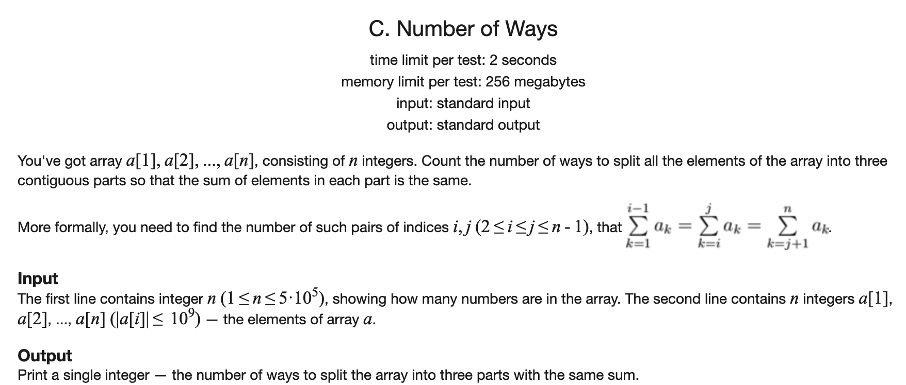
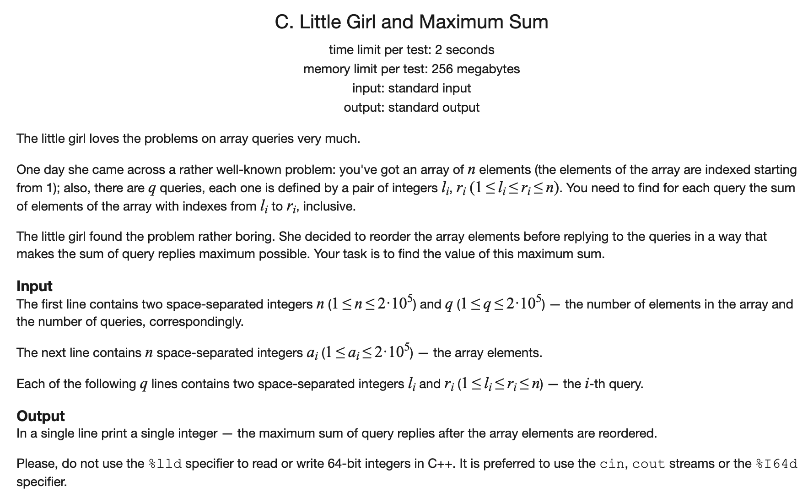

[toc]

### 1. Number of Ways

[原题链接](https://codeforces.com/problemset/problem/466/C)



#### 解题思路

首先求出所有数字的和，如果不能被3整除则直接返回0

然后问题就转化为求`i, j` 对使其满足：

- `i < j`
- `s[i] = sum / 3`
- `s[j] = sum / 3 * 2`

只需要一趟扫描，记录满足和为三分之一的位置的个数，如果当前和为三分之二，则加上其之前和为三分之一的个数即可。

#### C++代码

```c++
#include <iostream>
using namespace std;
typedef long long LL;
const int N = 5e5 + 10;

LL s[N];

int main() {

    int n;
    cin >> n;
    LL ans = 0;
    for (int i = 1; i <= n; i ++) {
        cin >> s[i];
        s[i] += s[i-1];
    }
    if (s[n] % 3) cout << 0;
    else {
        LL one = s[n] / 3, two = one * 2;
        int cnt = 0;
        for (int i = 1; i < n; i++) {
            if (s[i] == two) ans += cnt;
            if (s[i] == one) cnt++;
        }
        cout << ans;
    }
    return 0;
}
```

### 2. Little Girl and Maximum Sum

[原题链接](https://codeforces.com/problemset/problem/276/C)



#### 解题思路

可以统计每个位置被加了多少遍，然后将加的次数最大的放上最大的数，这样依次安排即可。

#### C++代码

```c++
#include <iostream>
#include <algorithm>
using namespace std;

const int N = 2e5 + 10;
int q[N], cnt[N];

int main() {
    
    int n, Q;
    cin >> n >> Q;
    for (int i = 1; i <= n; i ++) cin >> q[i];
    while (Q --) {
        int l, r;
        cin >> l >> r;
        cnt[l] ++;
        cnt[r + 1] --;
    }
    sort(q + 1, q + n + 1);
    for (int i = 1; i <= n; i ++) {
        cnt[i] += cnt[i - 1];
    }
    sort(cnt + 1, cnt + n + 1);
    unsigned long long ans = 0;
    for (int i = 1; i <= n; i ++) ans += (unsigned long long) q[i] * cnt[i];
    cout << ans;
    return 0;
    
}
```

