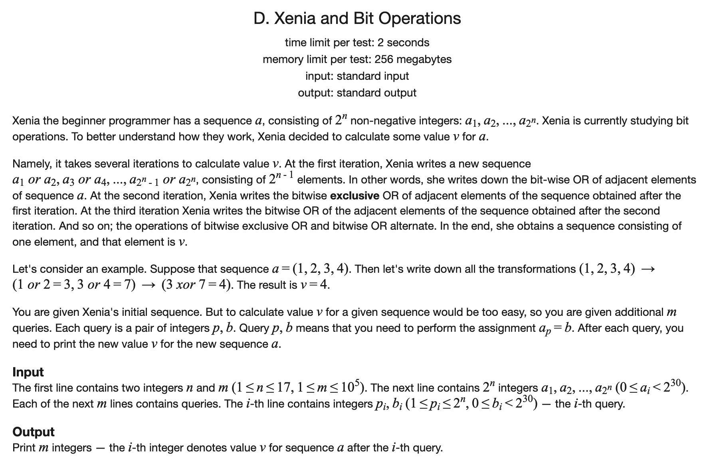

[toc]

### 1. Xenia and Bit Operations

[原题链接](https://codeforces.com/problemset/problem/339/D)



#### 解题思路

每次单点更新，然后查询结果，可以使用线段树来进行操作。每个节点还需要维护它的操作类型。

#### C++代码

```c++
#include <iostream>
#include <cmath>
using namespace std;

const int N = (1 << 17) + 10;

struct Node{
    int l, r;
    bool _or;
    int v;
};

int q[N];
Node tr[N * 4];


void pushup(int u) {
    if (tr[u]._or) tr[u].v = tr[u << 1].v | tr[u << 1 | 1].v;
    else tr[u].v = tr[u << 1].v ^ tr[u << 1 | 1].v;
}

void build(int u, int l, int r) {
    tr[u].l = l;
    tr[u].r = r;
    if (((int) (log2(r - l + 1))) & 1) tr[u]._or = true;
    else tr[u]._or = false;
    if (l == r) return;
    int mid = l + r >> 1;
    build(u << 1, l, mid);
    build(u << 1 | 1, mid + 1, r);
}

void modify(int u, int x, int v) {
    if (tr[u].l == x && tr[u].r == x) tr[u].v = v;
    else {
        int mid = tr[u].l + tr[u].r >> 1;
        if (x <= mid) modify(u << 1, x, v);
        else modify(u << 1 | 1, x ,v);
        pushup(u);
    }
}

int main() {

    int n, m;
    cin >> n >> m;
    build(1, 1, 1 << n);
    for (int i = 1; i <= (1 << n); i ++){
        int a;
        cin >> a;
        modify(1, i, a);
    }
    while (m --) {
        int x, a;
        cin >> x >> a;
        modify(1, x, a);
        cout << tr[1].v << endl;
    }
    return 0;


}
```


